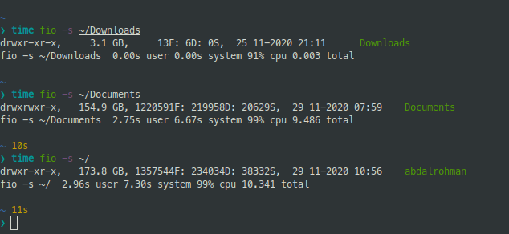
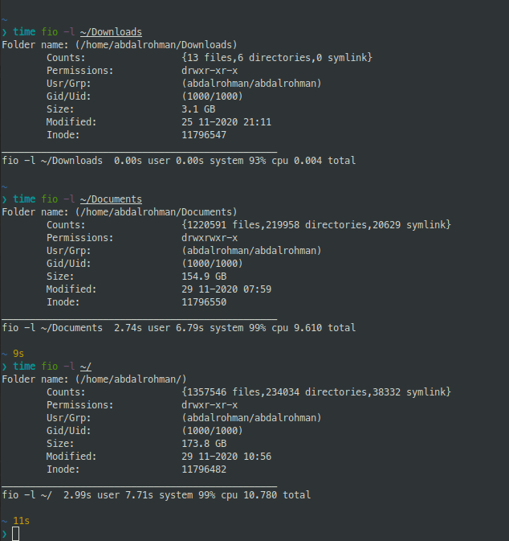

# fio: A Simple Tool for File Information

fio is a C command line tool that can display some information about files and directories in Linux systems. It can show the size, modification time, permissions, number of lines or subdirectories of each file or directory. It also uses different colors to indicate different file types.

## Requirements

To use fio, you need:

- A Linux system
- gcc
- make

## Installation

To install fio from GitHub, follow these steps:

1. Clone or download this repository:

```bash
git clone https://github.com/abdalrohman/file_info.git
```

2. Navigate to the directory where you cloned or downloaded it:

```bash
cd file_info
```

3. Compile the source code using make:

```bash
make
```

4. Install the executable using sudo:

```bash
sudo make install
```

## Usage

To use fio, run it as follows:

```bash
fio [-s | -l] [paths ...]
```

The `-s` option enables the short mode, which displays some basic information about each path in one line.

The `-l` option enables the long mode, which displays more detailed information about each path in a table format.

If no option is given, the short mode is used by default.

If no path is given, the current directory (.) is used by default.

For example, to display some information about the current directory in short mode:

```bash
fio
```

The output will look something like this:



To display more information about the current directory and a file in long mode:

```bash
fio -l . fio.c
```

The output will look something like this:



To print help information:

```bash
fio -h
```

## License

This project is licensed under the GNU V3.0 License. See the [LICENSE](LICENSE) file for more details.

## Author

This project was created by Abdulrahman Alnaseer as part of my CS50 Final Project.

Email: abdd199719@gmail.com
